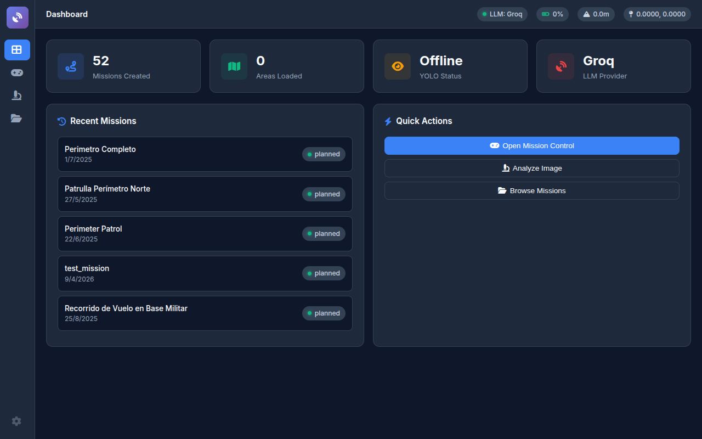
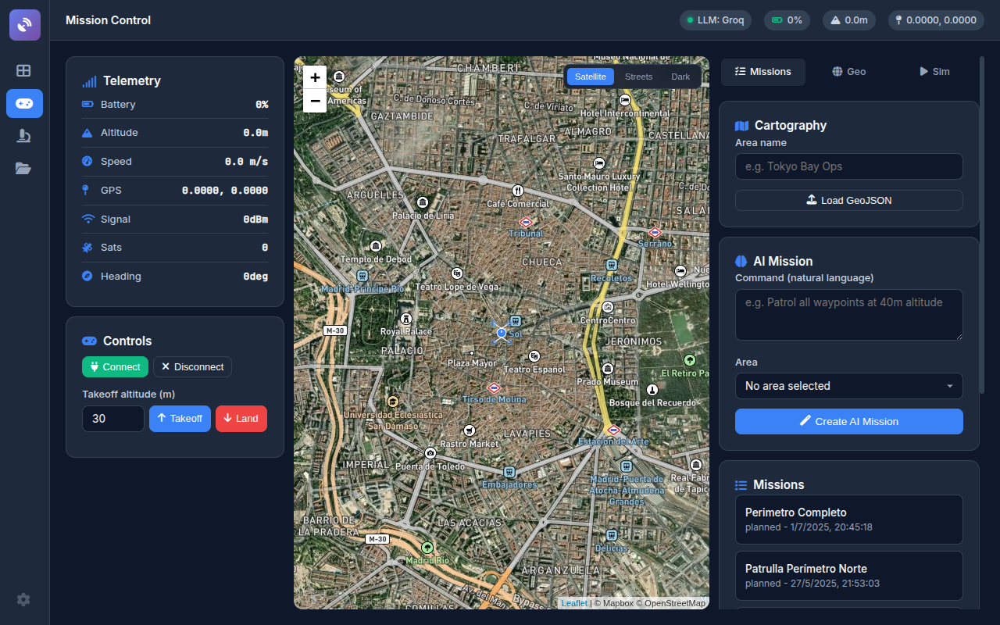
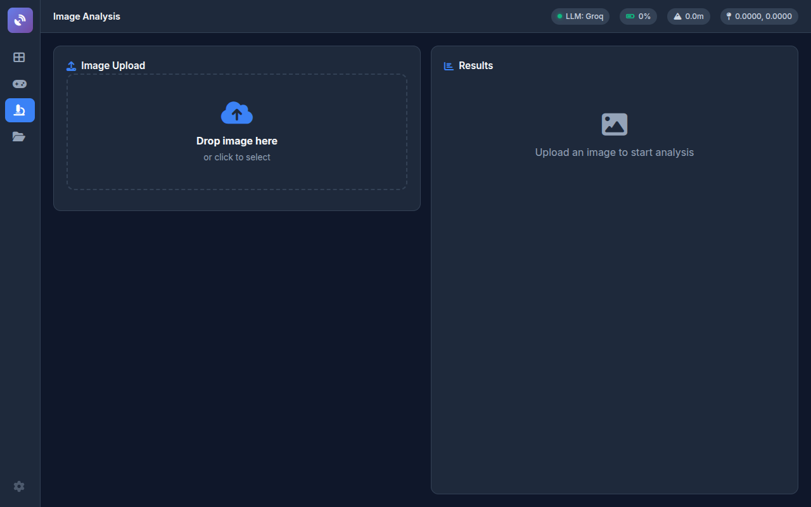
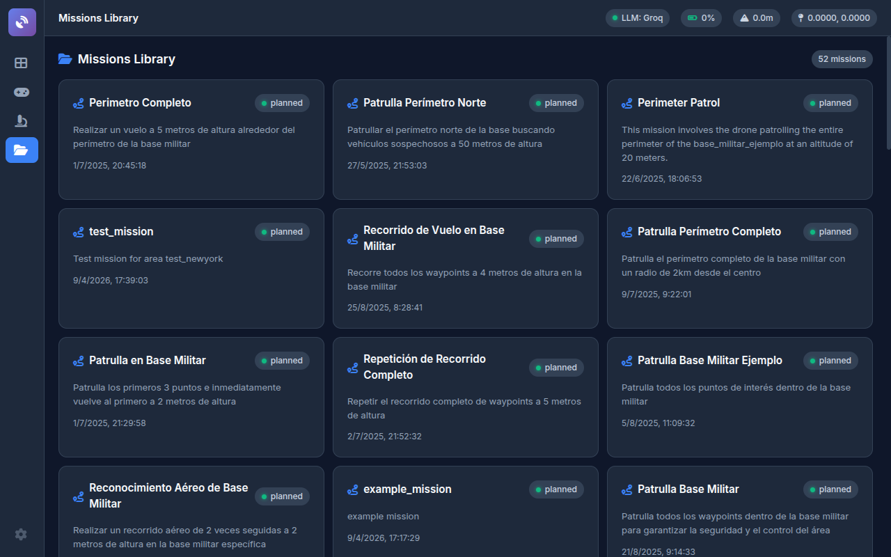

# Drone Geo Analysis

Enterprise ISR platform: drone control, geospatial analysis, real-time video processing, and LLM-powered autonomous missions.



## Screenshots

### Mission Control -- Satellite Map + AI Mission Planner


### Image Analysis -- YOLO Object Detection


### Missions Library -- 52 Planned Operations


## How It Works

```
Natural Language Command -> LLM Mission Planner -> GPS Waypoints + Actions
                                                         |
Drone (Parrot ANAFI) <- Telemetry Streaming <- Mission Execution Engine
         |
    Video Feed -> YOLO Detection -> Geo Correlation -> Change Detection
```

The operator describes a mission in natural language. The LLM (Groq/Llama or OpenAI) generates GPS waypoints, altitudes, actions, and safety constraints. The drone executes the mission while streaming video processed by YOLO for real-time object detection and geographic change analysis.

## Features

- **Mission Control**: Satellite map (Mapbox), real-time telemetry, LLM-powered mission planning from natural language
- **YOLO Detection**: YOLOv11 object detection on drone imagery
- **Geo Analysis**: Triangulation, geographic correlation, change detection
- **52 Missions**: Library of planned ISR operations (perimeter patrols, base surveillance, reconnaissance)
- **Parrot ANAFI**: Full drone control via Olympe SDK (connect, takeoff, waypoints, land)
- **Multi-LLM**: Groq (Llama 4 Scout), OpenAI, Docker Model Runner (local/offline)
- **Cartography**: GeoJSON area management with POIs and security boundaries
- **Chat Interface**: LangGraph ReAct agent for querying analysis results

## Tech Stack

| Layer | Technology |
|-------|-----------|
| Backend | Flask + Waitress (production WSGI) |
| LLM | Groq API (Llama 4 Scout) / OpenAI / Docker Model Runner |
| Object Detection | YOLOv11 (Ultralytics 8.3) + PyTorch 2.5 |
| Drone SDK | Parrot Olympe 7.7.5 (ANAFI control) |
| Maps | Leaflet + Mapbox (satellite/dark tiles) |
| Geo | GeoJSON, triangulation, correlation |
| Agent | LangGraph ReAct (mission planning + Q&A) |
| Deploy | Docker Compose (4GB limit, health checks) |

## Architecture

```
src/
  controllers/          # Flask blueprints (API routes)
    analysis_controller.py    # Image upload, YOLO, chat
    drone_controller.py       # Drone connect/takeoff/land
    geo_controller.py         # Triangulation, change detection
    mission_controller.py     # Mission CRUD, LLM planning
  services/             # Business logic
    analysis_service.py       # Image processing pipeline
    drone_service.py          # Parrot ANAFI integration
    geo_service.py            # Geographic calculations
    mission_service.py        # Mission orchestration
    chat_service.py           # LangGraph ReAct agent
  models/               # Domain models
    geo_analyzer.py           # Geographic analysis engine
    mission_planner.py        # LLM mission generation
    yolo_object_detector.py   # YOLOv11 inference
  drones/               # Hardware abstraction
    base_drone.py             # Abstract drone interface
    parrot_anafi_controller.py # Parrot ANAFI implementation
  geo/                  # Geospatial primitives
  processors/           # Data processing (change detection, video)
  templates/            # Jinja2 HTML (SPA dashboard)
  static/               # CSS, JS, assets
tests/                  # 44 test files, 391 pytest tests (+ 107-test services runner, 95.3%)
cartography/            # GeoJSON area definitions
missions/               # Saved mission files
```

## Quick Start

```bash
git clone https://github.com/infantesromeroadrian/Drone-GeoAnalysis-LLMs.git
cd Drone-GeoAnalysis-LLMs
cp .env.example .env
# Edit .env with your API keys (Groq, Mapbox)

docker-compose up --build
# Open http://localhost:4001
```

### Local (without Docker)

```bash
pip install -r requirements.txt
python src/main.py
# Open http://localhost:5000
```

## Environment Variables

| Variable | Description | Required |
|----------|-------------|----------|
| `LLM_PROVIDER` | `groq`, `openai`, or `docker` | Yes |
| `GROQ_API_KEY` | Groq API key | If provider=groq |
| `OPENAI_API_KEY` | OpenAI API key | If provider=openai |
| `SECRET_KEY` | Flask session key | Yes |
| `MAPBOX_TOKEN` | Mapbox public token (satellite tiles) | Optional |

## Testing

```bash
# Services smoke runner (107 tests). Full pytest suite = 391 tests / 44 files
python tests/services_test/run_services_tests.py

# Individual services
python tests/services_test/run_services_tests.py geo_service
python tests/services_test/run_services_tests.py drone_service
python tests/services_test/run_services_tests.py mission_service
```

| Module | Tests | Success |
|--------|-------|---------|
| GeoService | 31 | 100% |
| DroneService | 32 | 96.9% |
| MissionService | 29 | 96.6% |
| AnalysisService | 15 | 80% |
| **Total** | **107** | **95.3%** |

### Local development setup

**Python version requirement:** 3.10–3.13 (torch 2.5.1 does not support Python 3.14+).

If your system Python is outside this range, install a compatible version with `pyenv`:

```bash
# Install pyenv if not present (Linux/macOS)
curl https://pyenv.run | bash

# Install Python 3.11 (recommended, matches CI):
pyenv install 3.11
pyenv local 3.11   # writes .python-version in this directory

# Verify:
python --version   # should show 3.11.x
```

Then create the venv and install:

```bash
python -m venv .venv
source .venv/bin/activate
pip install -r requirements-dev.txt
pytest
```

**Why this matters:** `requirements.txt` pins `torch==2.5.1` which only ships wheels for Python 3.10–3.13. Newer Python versions will fail at `pip install` with "no matching distribution" errors.

The Docker container uses Python 3.11-slim, matching CI exactly. If you cannot install Python 3.11 locally, run via Docker:

```bash
docker-compose up --build
```

## License

Copyright (c) 2025-2026 Adrian Infantes Romero. **All rights reserved.**

This software is proprietary. See [LICENSE](LICENSE) for full terms.

---

Built by [Adrian Infantes](https://github.com/infantesromeroadrian)
